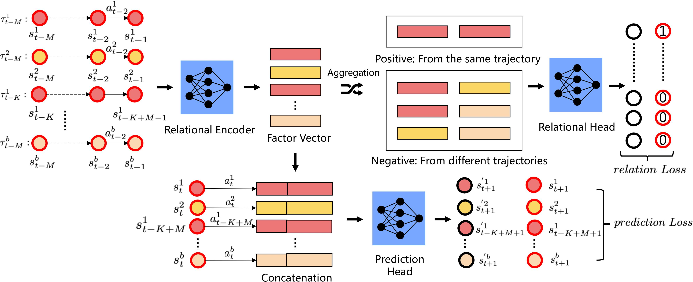
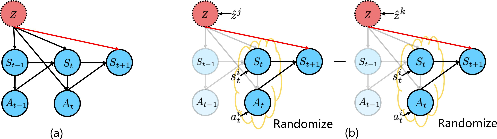

# A Relational Intervention Approach for Unsupervised Dynamics Generalization in Model-Based Reinforcement Learning

TensorFlow implementation of "[A Relational Intervention Approach for Unsupervised Dynamics Generalization in Model-Based Reinforcement Learning](https://openreview.net/forum?id=YRq0ZUnzKoZ)" (ICLR 2022).

## Method



An overview of our Relational Intervention approach, where Relational Encoder, Prediction Head and Relational Head are three learnable functions. Specifically, *prediction Loss* enables the 
estimated environmental-specified factor can help the Prediction head to predict the next states, and the *relation Loss* aims to enforce the similarity between factors estimated from the same trajectory or environments.



Because the mediator in other paths *e.g.* $S_t$, $A_t$, may amplify or reduce the causal effect of environmental-specific $Z$, we only consider the direct path from $Z$ to the next state(denote by the red line at Figure \ref{fig:inter} (a)), which means that we need to block all paths with meditors from $\hat{{Z}}$ to $S_{t+1}$.
- [Paper](https://openreview.net/forum?id=YRq0ZUnzKoZ)

## Instruction

Install MuJoCo 2.1.0 at ~/.mujoco/mujoco210 and copy your license key to ~/.mujoco/mjkey.txt

Install required packages with below commandsv:

```
conda create -n ria python=3.6
pip install -r requirements.txt
conda activate ria
```

Train and evaluate agents:

```
python -m run_scripts.run_ria --dataset [pendulum/hopper/slim_humanoid/halfcheetah/cripple_halfcheetah] --normalize_flag  --relation_flag 1 --contrast_flag 1 
```

## Reference

```
@article{guo2022relational,
  title={A Relational Intervention Approach for Unsupervised Dynamics Generalization in Model-Based Reinforcement Learning},
  author={Guo, Jixian and Gong, Mingming and Tao, Dacheng},
  journal={arXiv preprint arXiv:2206.04551},
  year={2022}
}
```
Note: this code is based on the [previous work](https://github.com/younggyoseo/trajectory_mcl) by Kimin Lee and Younggyo Seo. Many thanks to [Kimin Lee and Younggyo Seo](https://github.com/younggyoseo/).
